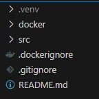
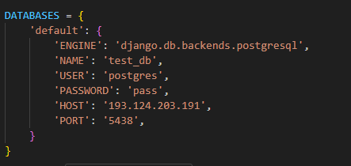
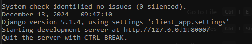

# Подготовка к работе

## Подготовка окружения:
1. Клонируете репозиторий к себе командой `git clone https://github.com/glotov-vd/lion-drive-client-app-backend.git`
2. Устанавливаете python 3.11.* (выше нельзя, так как проект перестает нормально собираться)
3. Обновим сборщик пакетов pip командой `python -m pip install --upgrade pip`
4. Создаем виртуальную среду: `python -m venv .venv`
5. Активируем ее: `.venv\Scripts\activate.bat` (для Windows) или `source .venv/bin/activate` (для Linux и MacOS)

После активации у вас слева должна появиться надпись (.venv). В проекте должна появиться папка `.venv`




6. Устанавливаем Django командой `python -m pip install Django`

([ссылка на более подробную инструкцию](https://metanit.com/python/django/1.2.php))

7. Установить ещё несколько дополнительных пакетов:

```
pip install psycopg2
pip install djangorestframewor
pip install markdown 
pip install django-filter 
```

---
## Подготовка базы данных

**ВАЖНО:** для следующего шага необходимо установить postgresql на свой компьютер
([ссылка на инструкцию по установке](https://metanit.com/sql/postgresql/1.1.php))

В данном проекте все необходимое находится в папке `~/src`. 
Перейдя в нее необходимо зайти в папку `~/src/client_app` и открыть файл `settings.py`

Необходимо поменять настройки на свои для полей: `NAME, USER, PASSWORD, HOST, PORT`
(скорее всего ваш HOST будет 192.0.0.1, а PORT 5432)



В самом Postgres нужно создать базу данных: `CREATE DATABASE <название_БД>`;
Это же название необходимо разместить в поле `NAME`

---
## Запуск проекта

Если предыдущие шаги пройдены успешно, то:

1. Заполним базу данных информацией: `python ./src/manage.py migrate`
2. Запустим проект: `python ./src/manage.py runserver`



Если увидели это сообщение - `ПОЗДРАВЛЯЮ`😎